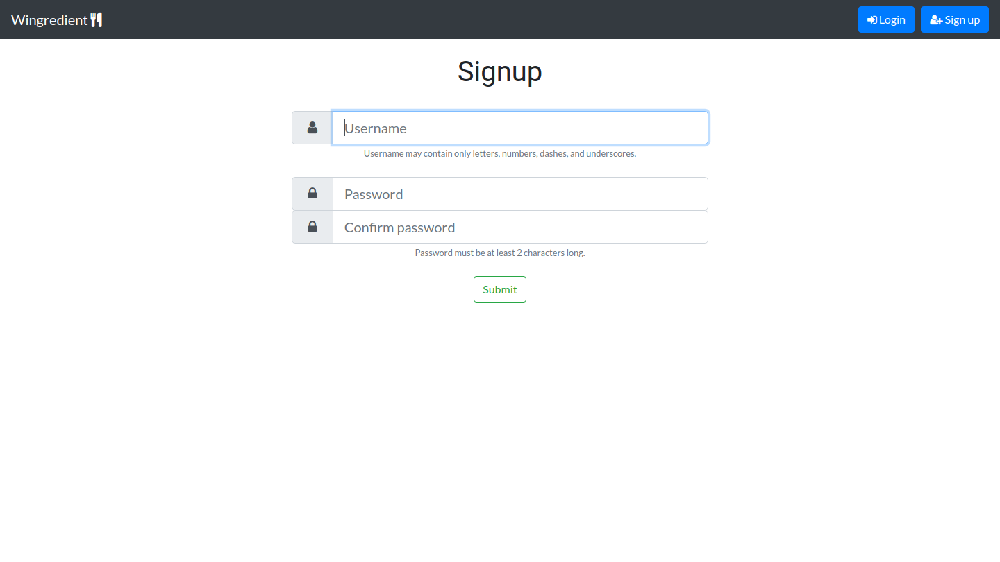

# Wingredient
Recipe search app where you input what ingredients you have, and it searches for recipes you can make with them.

Uses Bootstrap & Mako for frontend, and Flask & PostgreSQL for backend.

Uni project for COMP4920 "Management and Ethics"

## Contents
- [Screenshots](#Screenshots)
- [Project Structure](#ProjectStructure)
- [Developing](#Developing)
    - [Setting Up](#SettingUp)
    - [Running the Web App](#RunningTheWebApp)
        - [Setting up the database](#SettingUpTheDatabase)
        - [Running the app](#RunningTheApp)
        - [Troubleshooting install](#TroubleshootingInstall)

<a name="Screenshots"/>

## Screenshots
<p align="center">
    
    <br>
    <i>Search for recipes based on what ingredients you have and refine your search with (optional) filters</i>
</p>
<br>

<p align="center">
    
    <br>
    <i>Browse through results displaying the recipes' like rate, preparation time & difficulty, and any tags</i>
</p>
<p align="center">
    
</p>
<br>

<p align="center">
    
    <br>
    <i>Users can create an account on the site to get access to extra features like...</i>
</p>
<br>

<p align="center">
    
    <br>
    <i>A virtual pantry where you can record what ingredients you have at home (for expediant searching)</i>
</p>
<br>

<p align="center">
    
    <br>
    <i>Ability to like/dislike/favourite recipes, and remove its ingredients from your pantry (or add them to your virtual shopping list)</i>
</p>
<br>
<p align="center">
    
    <br>
    <i>(le Virtual Shopping List)</i>
</p>
<br>

<p align="center">
    
    <br>
    <i>And logged-in users can submit their own recipes to the site!</i>
</p>
<br>

<p align="center">
    
    <br>
    <i>User settings can be changed on the profile page</i>
</p>
<br>

<a name="ProjectStructure"/>

## Project Structure
The *wingredient* directory is our main Python package. This is strucured like a very basic Flask app for now.

<a name="Developing"/>

## Developing

<a name="SettingUp"/>

### Setting up
1. Make sure you have Python 3.7 installed. On Debian/Ubuntu, you'll need the `python3.7-venv` package as well. If you're on an Ubuntu version lower than 18.04, add the [deadsnakes apt repository](https://launchpad.net/~deadsnakes/+archive/ubuntu/ppa).
2. Create a Python virtual environment
    - simply run the `make newenv` command.
3. Activate the virtual environment - **do this first when developing/testing/running/tooling** (you'll see `(.venv)` on your console prompt if you're activated)
    - from the project root directory, run `source .venv/bin/activate` on Mac/Linux or `.\.venv\Scripts\activate` on Windows.
4. Set up your editor/IDE if you're using one, so that it uses your virtual environment. In VS Code and PyCharm (and possibly other editors), this means you don't have to activate your virtual environment all the time, as long as you use the integrated terminal.
    - Visual Studio Code: In workspace settings, set the `python.pythonPath` setting to `${workspaceFolder}/.venv/bin/python` on Mac/Linux or `${workspaceFolder}/.venv/Scripts/python.exe` on Windows.
    - PyCharm: Go to *File* -> *Settings* -> *Project* -> *Project Interpreter*, add a Python interpreter, select *Existing environment*, and set the path to the python executable as above, in the VS Code instructions, where `${workspaceFolder}` is the project root directory.
    - Other editors: Probably a similar process to above, you simply need to tell the editor where to find the Python interpreter executable for this project.

<a name="RunningTheWebApp"/>

### Running the Web App

#### Short version

##### If running for the first time
In the project root:
1. `make`
2. `make newenv`
3. `source .venv/bin/activate`
4. `wingredient-initdb` (make sure your user was added to the DB beforehand)
5. `wingredient`

##### If not running for the first time
`source .venv/bin/activate` and `wingredient` are sufficient.

<a name="SettingUpTheDatabase"/>

#### Setting up the database
Make sure your user account has privileges on the database you're connecting to.

On Linux (replace <username> with your Linux username):
```bash
$ sudo -u postgres psql
postgres=# DROP DATABASE IF EXISTS wingredient;
postgres=# CREATE DATABASE wingredient;
postgres=# CREATE USER <username>;
postgres=# GRANT ALL PRIVILEGES ON DATABASE wingredient TO <username>;
```

Now, set up the config file. Whilst in the project root directory:
```bash
$ cp config_template.yml wingredient.yml
```
Then, edit `wingredient.yml` to change to the correct configuration. All you should need to do is uncomment the `dbname: wingredient` line.

Now, populate the database with the command:
```bash
$ wingredient-initdb
```

<a name="RunningTheApp"/>

#### Running the app

If the command isn't found, run `make syncenv` again.

Provided that you set up as described above, can simply run the web app with the `wingredient` command, in an activated terminal. At the moment it just runs on localhost:5000, but this will probably change at some point.

<a name="TroubleshootingInstall"/>

#### Troubleshooting install
If you get an error along the lines of `pg_config executable not found`, you need to install the `postgresql` package (which contains it). 
This can be installed on Debian/Ubuntu with `sudo apt install postgresql` ([StackOverflow thread on the error](https://stackoverflow.com/questions/11618898/pg-config-executable-not-found)).
<p align="center">
    
</p>

If you then get an error along the lines of `fatal error: libpq-fe.h: No such file or directory #include <libpq-fe.h>`, it can be found in the `libpq-dev` package, which can be installed with `sudo apt install libpq-dev` ([StackOverflow thread on the error](https://unix.stackexchange.com/questions/345814/gcc-error-installing-psycopg2-package-for-python3-on-centos-7-3)).
